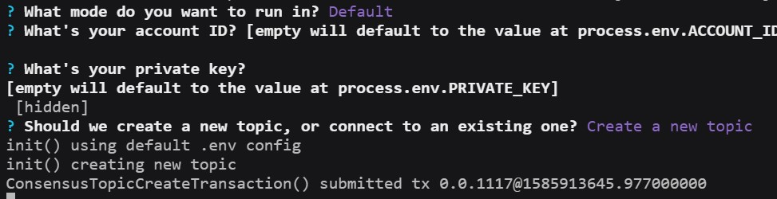

# POC - Hedera Consensus Service Filecoin
A proof of concept of using Hedera HCS and Filecoin as a baseline for an enterprise version of Itheum's data DEX. Once the POC is complete a new repo will be created to begin formal project delivery.

## Architecture
<svg xmlns="http://www.w3.org/2000/svg" xmlns:xlink="http://www.w3.org/1999/xlink" version="1.1" width="1356px" viewBox="-0.5 -0.5 1356 968" content="&lt;mxfile host=&quot;app.diagrams.net&quot; modified=&quot;2021-11-25T02:53:44.938Z&quot; agent=&quot;5.0 (Macintosh; Intel Mac OS X 10_15_7) AppleWebKit/537.36 (KHTML, like Gecko) Chrome/95.0.4638.69 Safari/537.36&quot; etag=&quot;bsnbZT2PmPcPl_ptjlu1&quot; version=&quot;15.0.3&quot; type=&quot;github&quot;&gt;&lt;diagram id=&quot;kgpKYQtTHZ0yAKxKKP6v&quot; name=&quot;Page-1&quot;&gt;7Vxbd9q6Ev41rHXOQ7p8Bx5D0uzkrPQ0p7R7t4/CFqBTY7FtEUJ//R7Jkq8COwHjpCsvCRbyTTPzzTcXMbCvVk9/xGi9/EQDHA4sI3ga2NcDyzIdy4N/fGSXjowMMx1YxCSQk/KBKfmF5aAhRzckwElpIqM0ZGRdHvRpFGGflcZQHNNtedqchuW7rtEC1wamPgrro3+RgC3lW7hGPn6LyWKp7mwa8psVUpPlQLJEAd0WhuyPA/sqppSln1ZPVzjki6fWJT3vZs+32YPFOGJtTthMfyz/Z3vse4hml1+j0fDm2/WFvMojCjfyhe/YEm9WMHaNGOL/Pn6Xz892alGSLVmFKIKjiTwfxww/7X0wM3td0BNMV5jFO5giT7CVrKWKZLLf5gs+VGPLwmIPh3IQSSEvsmvn6wAf5FI8Z1ms2jvjAPRCHtKYLemCRij8mI9OYrqJAswva8BRPuee0jUMmjD4f8zYTio52jAKQ0u2CuW3+Imw74XPP/ilPrjy6PpJXlkc7NRBBO/7vXhQOIsf5qeJI3Ve+n78pfZK7ZDCJHQT+/jAPFfaKooX+ND1RnrViHGIGHksP9zJxezWtH8KZ+EYxr6tQ4oC+PCf6ef/CtDhb51eE54D/gy4vXl/b7j9TqSxPCD/Zz4In9AKRD+JZsk6W/OCTpU1ZrskDE/XSKzrFuC0rB2tLG2/zPaan1O2PrdufKalMT6vK9sb1YSSr+hlwN+fJDjHpznl4ppywIYLR/DndnL5pSiEKngt0Zp/XMfUx0nSvPAzEOpCiOrzhoWEw54YF48CnuIyJIsIxhhddygmy2yUkzPSyMl2uhKU5fYCki8EvJeAa9cgaY5bomSBMPQAk+oxCyb5B45wjBhOQTDkhjYDO/QWEvfKsHiLkmULi0wY5ha0xjGBBwcYToce8uMmU52TJ6xIZJeYaQ2dkjFmrK8JNUddGaPj9GGMCWguu+Q0GwYiKhihGLsh/PFfbHivldUokTYbrHWkwYpTYWXRrjBhTUnEksKVH/hArpZexUeYTiUkaJhvGYfnW8Mj54/diqKnb5irfbZUR7glQ0cgBETNqXi63EYUJPEvLhKh5ZcwwbTWTyUaJ2BtymjMAW9OBNcQjLAOfncPN1N4bjAAfEUFH0FRoJ3JNajIIe+pD7pB+SnfvtyX7h+m/2/SF1Ao++Zh1LHHzTA6PCuM9sNpzgiRbSC7cxi1WsKo3SvvUY+p5z2lkE9j3lsCKixNWWIAZUsRXNYnbxLxBSwvjjGfCm+AtDOD9Lb/kv/XMX4kePvv3wANrGEZDbLItAkNTLMrOLDrvkR5ARBlCb0hnKTzImhrZCew/RYHoEIDC57IyFxAZSKLUZQgX3qD+vcxnoOeRD7OVGuzDoRaVmeWExOH0xFvT2Uct4XKeGdVGdesresrjopfgzdwvJbewBn26Q3UYxawYLLZCdjeIkHLU0o42+yq3uE1pv0q1MvRJN3Pm/dLpbsn8fcnYM+8sK4p6E34Uv92iT6jWTJnzvS5o3dWfIaSSdvkguv0iYNunRNdLbEgwaV0n8HpkJa7/L0hKcltotBogUiUsAJpkun+QznHh5SIpbcH3EA+YW1g4u2wnipRdrzeibLiYe8I0SlCOG0R4lim9LL0owqXVInKLKX7muePD6cT7SPne+4Z0o9KRgV4/EQfeaCW1iWBJP7EUaIFsXlMVymDFLRyX+IwweKLrCTNJ795UHPccknlNYBanZHeYObnWR0pr0KuV+PDhKzmBHAtrVtniYOmqtnnOOCSLWQUUuenog5N2oBrBNDdRxKIzIAveK/UlDRt/eb1xHYrRt02Z9xhlqhP35f7u1beDw4KQu262NY6IdzSr+1RjTMlAGpo8C3N2t7TBbeyOw4AfxJUpKt3AayF4J8aDblHMxyWpYpkiOmLTLAm9lyRIEgVCCfkF5qJ63FpSOcMF3cnA/f6kAXKXkl58iDrUGy0TPugZRofLHskb/E8opF7bjWFzucJz41WRHaK8mBNihJuc1i9gb/Tw351swovfUaLEhLSfKAJEVlb+3pGGQP3sC99UBA6TbMNV1kLq9EWPw9DZVZOU9nRUR0qbQ1SdpbiqWfQ/sIzPvIprXZIScgU+56l93ewWGBedouETgqy97OmDE8i/ZZ7moV3KsRTk5XWJXDGXa17P8GZcitmxa2Mxg2ORRzVvJTW3ylP+OL+rZOXLL0jXdTLIi8Z2WSRkdcQGVWbPp853xwdnu/ax80f2xWd7yBQU3RQU9tLObsozlVLZhrWXp2hawk27q4PpKDeJBkYN5ABw6iUGOzjqIF6bLt00Qsg++VLdEcd1K0rGsN3kAAJJLMYiRXwY5x2CHDxR3jL35nyvyJCTMM/rhxSM9KlV0qnYnsxi/CPs3TahRglnGiKP7XrcA2TFylMyLUO3N1PEi2adBH0gw0qTX4x/QnsJOR0R6W+IJoMK0Pt1VXntsv+5hTsp4IpQ02cqCtwWV15YbMeQBQwIqkTnnyXDe/7Uu6aL4+/JGFwj3bAHAc8Uofz1dFkSWPyC+ajUpOmdNOWV5ox5WfKawoMwQ9qfc3K0Cf0VJp4jxJFVX0ahmidkBRC+Ikr8JIkmkgGfCqJWpXQ39ZI1NFF/obTlUjrO0juGOY5oXoXgDSs51pTiOdsbxCRgA2BTd+LOddOPvJFvj0fonDuPBR56yVYII6EtTHE9jqMCSziFSda4DqsKzg282PhTdbAByFcgXdBRMgOgzZsccLaCvqAgdTFr8IXr5241bzTS7sev0hpW+/SPrW0Xatvadezv1La9Xzfu7SPlPZw1Le0e2lxGJwuQDXb7rg8NkA9rqW2DqFZ9eTKGlwaNSmcdq+xabr6yLSoeWpbQ4VEdFY+qG+vuuYFmy3n7/GGBw0gfP53yz9HNIBZN43dnHUif8p4kutykld79MhXYK1WK+Ed0JkD/VIlger2r+o6QDuj+Vbdb2TlAN4Zs+A/lCADuturadcKX903amvqZXqF7ywdadfjaJVYWZoqsSLbeLKtL/k3anCt7XFO4+CLzDwWqht7WNxIs957sbpdGZohVXY3wCDYbi0ibf4ixhbBF6KSEQQxr76mbvZ0d+Z9/7LBqnpvMEIe4PM7trndcM+8kyUEJF+BATc/+ipcI9+lpc8D6BnNs3MDB0yzLZLoesnHOkPpDkr66bvssENqT9V6cK4sfuv9m72k8UdmOY1vNTQ4mUYlx/X8E2yjoqUdZNrtXvYmn0eNHc8uKvIHwxgfVGZdA8YJFdxureC9dAiOnHL23rHO0JFn15N0l3MmvDePc3GUbLKseoyRvxS9yZruqiWOFC1PN26JFHtTRai8l6u4cyvADJFQ3wpYqgbMdLtI3iK/b+pXqNbNdRleXW9XZx0LKgvVF3TlaPWj+F0b6PJDlCTEr6DXibMOrfcs9IM3XuV3Ojy3wT9Wf4usckJHLcP1eEiGNPBweBGL/rEUnxaUBlqNfHPl49SyDjWTjcZWSRaqTf719pa5dU+zN/T/ytvAB7zRLH4kvqbd6cR5r1FZsYcaaNWmATr7qQWF2b8PKzwlrrbe6eH2w+PKrR1eQ/+QaQyHx52gfuuxUyD26j+HWezFfy/RN+KMW/3Fn5Z1ne5K9J5Vk+l7if7FGTRvj/hfS4neq1Op9xJ9V9LuvUTv1Tuq3kv0XUm79xK91+tvc6nk3fP2GJfj95xWPqPx/czMUyFoX30EcJj/JnpK7PJflrc//gM=&lt;/diagram&gt;&lt;/mxfile&gt;" onclick="(function(svg){var src=window.event.target||window.event.srcElement;while (src!=null&amp;&amp;src.nodeName.toLowerCase()!='a'){src=src.parentNode;}if(src==null){if(svg.wnd!=null&amp;&amp;!svg.wnd.closed){svg.wnd.focus();}else{var r=function(evt){if(evt.data=='ready'&amp;&amp;evt.source==svg.wnd){svg.wnd.postMessage(decodeURIComponent(svg.getAttribute('content')),'*');window.removeEventListener('message',r);}};window.addEventListener('message',r);svg.wnd=window.open('https://viewer.diagrams.net/?client=1&amp;page=0&amp;edit=_blank');}}})(this);" style="cursor:pointer;max-width:100%;max-height:968px;"><defs><clipPath id="mx-clip-189-48-132-26-0"><rect x="189" y="48" width="132" height="26"/></clipPath><clipPath id="mx-clip-189-74-132-26-0"><rect x="189" y="74" width="132" height="26"/></clipPath><clipPath id="mx-clip-189-100-132-26-0"><rect x="189" y="100" width="132" height="26"/></clipPath><clipPath id="mx-clip-509-46-132-26-0"><rect x="509" y="46" width="132" height="26"/></clipPath><clipPath id="mx-clip-509-72-132-26-0"><rect x="509" y="72" width="132" height="26"/></clipPath><clipPath id="mx-clip-509-98-132-26-0"><rect x="509" y="98" width="132" height="26"/></clipPath></defs><g><path d="M 245 220 L 245 197 L 955 197 L 955 220" fill="#ffffff" stroke="#000000" stroke-miterlimit="10" pointer-events="all"/><path d="M 245 220 L 245 967 L 955 967 L 955 220" fill="none" stroke="#000000" stroke-miterlimit="10" pointer-events="none"/><path d="M 245 220 L 955 220" fill="none" stroke="#000000" stroke-miterlimit="10" pointer-events="none"/><g fill="#000000" font-family="Helvetica" font-weight="bold" pointer-events="none" text-anchor="middle" font-size="12px"><text x="599.5" y="213">Itheum Data DEX</text></g><path d="M 405 277 L 430 277 L 430 417 L 448.63 417" fill="none" stroke="#000000" stroke-miterlimit="10" pointer-events="none"/><path d="M 453.88 417 L 446.88 420.5 L 448.63 417 L 446.88 413.5 Z" fill="#000000" stroke="#000000" stroke-miterlimit="10" pointer-events="none"/><rect x="285" y="247" width="120" height="60" fill="#ffffff" stroke="#000000" pointer-events="none"/><g transform="translate(-0.5 -0.5)"><switch><foreignObject style="overflow: visible; text-align: left;" pointer-events="none" width="100%" height="100%" requiredFeatures="http://www.w3.org/TR/SVG11/feature#Extensibility"><div xmlns="http://www.w3.org/1999/xhtml" style="display: flex; align-items: unsafe center; justify-content: unsafe center; width: 118px; height: 1px; padding-top: 277px; margin-left: 286px;"><div style="box-sizing: border-box; font-size: 0; text-align: center; "><div style="display: inline-block; font-size: 12px; font-family: Helvetica; color: #000000; line-height: 1.2; pointer-events: none; white-space: normal; word-wrap: normal; ">Seller Upload JSON to sell as a "Data Pack" </div></div></div></foreignObject><text x="345" y="281" fill="#000000" font-family="Helvetica" font-size="12px" text-anchor="middle">Seller Upload JSON t...</text></switch></g><rect x="455" y="247" width="480" height="340" fill="#ffffff" stroke="#000000" pointer-events="none"/><path d="M 503 247 L 503 587 M 887 247 L 887 587" fill="none" stroke="#000000" stroke-miterlimit="10" pointer-events="none"/><g transform="translate(-0.5 -0.5)"><switch><foreignObject style="overflow: visible; text-align: left;" pointer-events="none" width="100%" height="100%" requiredFeatures="http://www.w3.org/TR/SVG11/feature#Extensibility"><div xmlns="http://www.w3.org/1999/xhtml" style="display: flex; align-items: unsafe flex-start; justify-content: unsafe center; width: 382px; height: 1px; padding-top: 254px; margin-left: 504px;"><div style="box-sizing: border-box; font-size: 0; text-align: center; "><div style="display: inline-block; font-size: 12px; font-family: Helvetica; color: #000000; line-height: 1.2; pointer-events: none; white-space: normal; word-wrap: normal; ">"Advertise Data for Sale in HBAR"</div></div></div></foreignObject><text x="695" y="266" fill="#000000" font-family="Helvetica" font-size="12px" text-anchor="middle">"Advertise Data for Sale in HBAR"</text></switch></g><path d="M 639 337 L 697.63 337" fill="none" stroke="#000000" stroke-miterlimit="10" pointer-events="none"/><path d="M 702.88 337 L 695.88 340.5 L 697.63 337 L 695.88 333.5 Z" fill="#000000" stroke="#000000" stroke-miterlimit="10" pointer-events="none"/><path d="M 519 297 L 619 297 L 639 337 L 619 377 L 519 377 L 539 337 Z" fill="#ffffff" stroke="#000000" stroke-miterlimit="10" pointer-events="none"/><g transform="translate(-0.5 -0.5)"><switch><foreignObject style="overflow: visible; text-align: left;" pointer-events="none" width="100%" height="100%" requiredFeatures="http://www.w3.org/TR/SVG11/feature#Extensibility"><div xmlns="http://www.w3.org/1999/xhtml" style="display: flex; align-items: unsafe center; justify-content: unsafe center; width: 118px; height: 1px; padding-top: 337px; margin-left: 520px;"><div style="box-sizing: border-box; font-size: 0; text-align: center; "><div style="display: inline-block; font-size: 12px; font-family: Helvetica; color: #000000; line-height: 1.2; pointer-events: none; white-space: normal; word-wrap: normal; ">Generate <br />"Data Hash"</div></div></div></foreignObject><text x="579" y="341" fill="#000000" font-family="Helvetica" font-size="12px" text-anchor="middle">Generate...</text></switch></g><path d="M 854 337 L 855 337 L 855 397 L 515 397 L 515 492 L 537.63 492" fill="none" stroke="#000000" stroke-miterlimit="10" pointer-events="none"/><path d="M 542.88 492 L 535.88 495.5 L 537.63 492 L 535.88 488.5 Z" fill="#000000" stroke="#000000" stroke-miterlimit="10" pointer-events="none"/><path d="M 684 297 L 834 297 L 854 337 L 834 377 L 684 377 L 704 337 Z" fill="#ffffff" stroke="#000000" stroke-miterlimit="10" pointer-events="none"/><g transform="translate(-0.5 -0.5)"><switch><foreignObject style="overflow: visible; text-align: left;" pointer-events="none" width="100%" height="100%" requiredFeatures="http://www.w3.org/TR/SVG11/feature#Extensibility"><div xmlns="http://www.w3.org/1999/xhtml" style="display: flex; align-items: unsafe center; justify-content: unsafe center; width: 168px; height: 1px; padding-top: 337px; margin-left: 685px;"><div style="box-sizing: border-box; font-size: 0; text-align: center; "><div style="display: inline-block; font-size: 12px; font-family: Helvetica; color: #000000; line-height: 1.2; pointer-events: none; white-space: normal; word-wrap: normal; "><font style="font-size: 12px">Store file to <br />IPFS/FileCoin and <br />get "Location URL"</font></div></div></div></foreignObject><text x="769" y="341" fill="#000000" font-family="Helvetica" font-size="12px" text-anchor="middle">Store file to...</text></switch></g><path d="M 694 492 L 717.63 492" fill="none" stroke="#000000" stroke-miterlimit="10" pointer-events="none"/><path d="M 722.88 492 L 715.88 495.5 L 717.63 492 L 715.88 488.5 Z" fill="#000000" stroke="#000000" stroke-miterlimit="10" pointer-events="none"/><path d="M 524 437 L 674 437 L 694 492 L 674 547 L 524 547 L 544 492 Z" fill="#ffffff" stroke="#000000" stroke-miterlimit="10" pointer-events="none"/><g transform="translate(-0.5 -0.5)"><switch><foreignObject style="overflow: visible; text-align: left;" pointer-events="none" width="100%" height="100%" requiredFeatures="http://www.w3.org/TR/SVG11/feature#Extensibility"><div xmlns="http://www.w3.org/1999/xhtml" style="display: flex; align-items: unsafe center; justify-content: unsafe center; width: 168px; height: 1px; padding-top: 492px; margin-left: 525px;"><div style="box-sizing: border-box; font-size: 0; text-align: center; "><div style="display: inline-block; font-size: 12px; font-family: Helvetica; color: #000000; line-height: 1.2; pointer-events: none; white-space: normal; word-wrap: normal; ">Generate Data Pack <br />with URL and other <br />user entered meta <br />data (data preview)</div></div></div></foreignObject><text x="609" y="496" fill="#000000" font-family="Helvetica" font-size="12px" text-anchor="middle">Generate Data Pack...</text></switch></g><path d="M 704 437 L 844 437 L 864 492 L 844 547 L 704 547 L 724 492 Z" fill="#ffffff" stroke="#000000" stroke-miterlimit="10" pointer-events="none"/><g transform="translate(-0.5 -0.5)"><switch><foreignObject style="overflow: visible; text-align: left;" pointer-events="none" width="100%" height="100%" requiredFeatures="http://www.w3.org/TR/SVG11/feature#Extensibility"><div xmlns="http://www.w3.org/1999/xhtml" style="display: flex; align-items: unsafe center; justify-content: unsafe center; width: 158px; height: 1px; padding-top: 492px; margin-left: 705px;"><div style="box-sizing: border-box; font-size: 0; text-align: center; "><div style="display: inline-block; font-size: 12px; font-family: Helvetica; color: #000000; line-height: 1.2; pointer-events: none; white-space: normal; word-wrap: normal; ">Store the "proof" <br />on Hedera, get <br />transaction <br />reference and update<br />Data Pack </div></div></div></foreignObject><text x="784" y="496" fill="#000000" font-family="Helvetica" font-size="12px" text-anchor="middle">Store the "proof"...</text></switch></g><path d="M 404 637 L 429 637 L 429 777 L 447.63 777" fill="none" stroke="#000000" stroke-miterlimit="10" pointer-events="none"/><path d="M 452.88 777 L 445.88 780.5 L 447.63 777 L 445.88 773.5 Z" fill="#000000" stroke="#000000" stroke-miterlimit="10" pointer-events="none"/><rect x="284" y="607" width="120" height="60" fill="#ffffff" stroke="#000000" pointer-events="none"/><g transform="translate(-0.5 -0.5)"><switch><foreignObject style="overflow: visible; text-align: left;" pointer-events="none" width="100%" height="100%" requiredFeatures="http://www.w3.org/TR/SVG11/feature#Extensibility"><div xmlns="http://www.w3.org/1999/xhtml" style="display: flex; align-items: unsafe center; justify-content: unsafe center; width: 118px; height: 1px; padding-top: 637px; margin-left: 285px;"><div style="box-sizing: border-box; font-size: 0; text-align: center; "><div style="display: inline-block; font-size: 12px; font-family: Helvetica; color: #000000; line-height: 1.2; pointer-events: none; white-space: normal; word-wrap: normal; ">Buyer wants to buy Data Pack</div></div></div></foreignObject><text x="344" y="641" fill="#000000" font-family="Helvetica" font-size="12px" text-anchor="middle">Buyer wants to buy D...</text></switch></g><rect x="454" y="607" width="480" height="340" fill="#ffffff" stroke="#000000" pointer-events="none"/><path d="M 502 607 L 502 947 M 886 607 L 886 947" fill="none" stroke="#000000" stroke-miterlimit="10" pointer-events="none"/><g transform="translate(-0.5 -0.5)"><switch><foreignObject style="overflow: visible; text-align: left;" pointer-events="none" width="100%" height="100%" requiredFeatures="http://www.w3.org/TR/SVG11/feature#Extensibility"><div xmlns="http://www.w3.org/1999/xhtml" style="display: flex; align-items: unsafe flex-start; justify-content: unsafe center; width: 382px; height: 1px; padding-top: 614px; margin-left: 503px;"><div style="box-sizing: border-box; font-size: 0; text-align: center; "><div style="display: inline-block; font-size: 12px; font-family: Helvetica; color: #000000; line-height: 1.2; pointer-events: none; white-space: normal; word-wrap: normal; ">"Verify Data and Buy"</div></div></div></foreignObject><text x="694" y="626" fill="#000000" font-family="Helvetica" font-size="12px" text-anchor="middle">"Verify Data and Buy"</text></switch></g><path d="M 694 712 L 712.63 712" fill="none" stroke="#000000" stroke-miterlimit="10" pointer-events="none"/><path d="M 717.88 712 L 710.88 715.5 L 712.63 712 L 710.88 708.5 Z" fill="#000000" stroke="#000000" stroke-miterlimit="10" pointer-events="none"/><path d="M 524 657 L 674 657 L 694 712 L 674 767 L 524 767 L 544 712 Z" fill="#ffffff" stroke="#000000" stroke-miterlimit="10" pointer-events="none"/><g transform="translate(-0.5 -0.5)"><switch><foreignObject style="overflow: visible; text-align: left;" pointer-events="none" width="100%" height="100%" requiredFeatures="http://www.w3.org/TR/SVG11/feature#Extensibility"><div xmlns="http://www.w3.org/1999/xhtml" style="display: flex; align-items: unsafe center; justify-content: unsafe center; width: 168px; height: 1px; padding-top: 712px; margin-left: 525px;"><div style="box-sizing: border-box; font-size: 0; text-align: center; "><div style="display: inline-block; font-size: 12px; font-family: Helvetica; color: #000000; line-height: 1.2; pointer-events: none; white-space: normal; word-wrap: normal; ">Check Data Hash of <br />required Data Pack <br />against Hedera for <br />"Proof of Veracity"</div></div></div></foreignObject><text x="609" y="716" fill="#000000" font-family="Helvetica" font-size="12px" text-anchor="middle">Check Data Hash of...</text></switch></g><path d="M 869 712 L 875 712 L 875 787 L 575 787 L 575 852 L 608.63 852" fill="none" stroke="#000000" stroke-miterlimit="10" pointer-events="none"/><path d="M 613.88 852 L 606.88 855.5 L 608.63 852 L 606.88 848.5 Z" fill="#000000" stroke="#000000" stroke-miterlimit="10" pointer-events="none"/><path d="M 699 657 L 849 657 L 869 712 L 849 767 L 699 767 L 719 712 Z" fill="#ffffff" stroke="#000000" stroke-miterlimit="10" pointer-events="none"/><g transform="translate(-0.5 -0.5)"><switch><foreignObject style="overflow: visible; text-align: left;" pointer-events="none" width="100%" height="100%" requiredFeatures="http://www.w3.org/TR/SVG11/feature#Extensibility"><div xmlns="http://www.w3.org/1999/xhtml" style="display: flex; align-items: unsafe center; justify-content: unsafe center; width: 168px; height: 1px; padding-top: 712px; margin-left: 700px;"><div style="box-sizing: border-box; font-size: 0; text-align: center; "><div style="display: inline-block; font-size: 12px; font-family: Helvetica; color: #000000; line-height: 1.2; pointer-events: none; white-space: normal; word-wrap: normal; ">Move HBAR tokens <br />from buyer and <br />send to seller</div></div></div></foreignObject><text x="784" y="716" fill="#000000" font-family="Helvetica" font-size="12px" text-anchor="middle">Move HBAR tokens...</text></switch></g><path d="M 595 797 L 745 797 L 765 852 L 745 907 L 595 907 L 615 852 Z" fill="#ffffff" stroke="#000000" stroke-miterlimit="10" pointer-events="none"/><g transform="translate(-0.5 -0.5)"><switch><foreignObject style="overflow: visible; text-align: left;" pointer-events="none" width="100%" height="100%" requiredFeatures="http://www.w3.org/TR/SVG11/feature#Extensibility"><div xmlns="http://www.w3.org/1999/xhtml" style="display: flex; align-items: unsafe center; justify-content: unsafe center; width: 168px; height: 1px; padding-top: 852px; margin-left: 596px;"><div style="box-sizing: border-box; font-size: 0; text-align: center; "><div style="display: inline-block; font-size: 12px; font-family: Helvetica; color: #000000; line-height: 1.2; pointer-events: none; white-space: normal; word-wrap: normal; ">Fetch URL from FileCoin <br />and finalise the <br />"Data Order" for Buyer <br />to provide access to file</div></div></div></foreignObject><text x="680" y="856" fill="#000000" font-family="Helvetica" font-size="12px" text-anchor="middle">Fetch URL from FileCoin...</text></switch></g><path d="M 50 297 L 155 297 L 155 582 L 238.63 582" fill="none" stroke="#000000" stroke-miterlimit="10" pointer-events="none"/><path d="M 243.88 582 L 236.88 585.5 L 238.63 582 L 236.88 578.5 Z" fill="#000000" stroke="#000000" stroke-miterlimit="10" pointer-events="none"/><g transform="translate(-0.5 -0.5)"><switch><foreignObject style="overflow: visible; text-align: left;" pointer-events="none" width="100%" height="100%" requiredFeatures="http://www.w3.org/TR/SVG11/feature#Extensibility"><div xmlns="http://www.w3.org/1999/xhtml" style="display: flex; align-items: unsafe center; justify-content: unsafe center; width: 1px; height: 1px; padding-top: 490px; margin-left: 156px;"><div style="box-sizing: border-box; font-size: 0; text-align: center; "><div style="display: inline-block; font-size: 11px; font-family: Helvetica; color: #000000; line-height: 1.2; pointer-events: none; background-color: #ffffff; white-space: nowrap; ">User Logs In Via Hedera Identity</div></div></div></foreignObject><text x="156" y="493" fill="#000000" font-family="Helvetica" font-size="11px" text-anchor="middle">User Logs In Via Hedera Identity</text></switch></g><ellipse cx="50" cy="274.5" rx="7.5" ry="7.5" fill="#ffffff" stroke="#000000" pointer-events="none"/><path d="M 50 282 L 50 307 M 50 287 L 35 287 M 50 287 L 65 287 M 50 307 L 35 327 M 50 307 L 65 327" fill="none" stroke="#000000" stroke-miterlimit="10" pointer-events="none"/><g transform="translate(-0.5 -0.5)"><switch><foreignObject style="overflow: visible; text-align: left;" pointer-events="none" width="100%" height="100%" requiredFeatures="http://www.w3.org/TR/SVG11/feature#Extensibility"><div xmlns="http://www.w3.org/1999/xhtml" style="display: flex; align-items: unsafe flex-start; justify-content: unsafe center; width: 1px; height: 1px; padding-top: 334px; margin-left: 50px;"><div style="box-sizing: border-box; font-size: 0; text-align: center; "><div style="display: inline-block; font-size: 12px; font-family: Helvetica; color: #000000; line-height: 1.2; pointer-events: none; white-space: nowrap; ">Data Buyer / Seller</div></div></div></foreignObject><text x="50" y="346" fill="#000000" font-family="Helvetica" font-size="12px" text-anchor="middle">Data...</text></switch></g><path d="M 365 42 C 365 33.72 382.91 27 405 27 C 415.61 27 425.78 28.58 433.28 31.39 C 440.79 34.21 445 38.02 445 42 L 445 102 C 445 110.28 427.09 117 405 117 C 382.91 117 365 110.28 365 102 Z" fill="#ffffff" stroke="#000000" stroke-miterlimit="10" pointer-events="none"/><path d="M 445 42 C 445 50.28 427.09 57 405 57 C 382.91 57 365 50.28 365 42" fill="none" stroke="#000000" stroke-miterlimit="10" pointer-events="none"/><g transform="translate(-0.5 -0.5)"><switch><foreignObject style="overflow: visible; text-align: left;" pointer-events="none" width="100%" height="100%" requiredFeatures="http://www.w3.org/TR/SVG11/feature#Extensibility"><div xmlns="http://www.w3.org/1999/xhtml" style="display: flex; align-items: unsafe center; justify-content: unsafe center; width: 78px; height: 1px; padding-top: 85px; margin-left: 366px;"><div style="box-sizing: border-box; font-size: 0; text-align: center; "><div style="display: inline-block; font-size: 12px; font-family: Helvetica; color: #000000; line-height: 1.2; pointer-events: none; white-space: normal; word-wrap: normal; ">Web2 Meta Data Store</div></div></div></foreignObject><text x="405" y="88" fill="#000000" font-family="Helvetica" font-size="12px" text-anchor="middle">Web2 Meta Dat...</text></switch></g><path d="M 609 547 L 590 547 L 275 547 L 275 167 L 465 167 L 465 80 L 451.37 80.01" fill="none" stroke="#000000" stroke-miterlimit="10" pointer-events="none"/><path d="M 446.12 80.01 L 453.12 76.51 L 451.37 80.01 L 453.12 83.51 Z" fill="#000000" stroke="#000000" stroke-miterlimit="10" pointer-events="none"/><g transform="translate(-0.5 -0.5)"><switch><foreignObject style="overflow: visible; text-align: left;" pointer-events="none" width="100%" height="100%" requiredFeatures="http://www.w3.org/TR/SVG11/feature#Extensibility"><div xmlns="http://www.w3.org/1999/xhtml" style="display: flex; align-items: unsafe center; justify-content: unsafe center; width: 1px; height: 1px; padding-top: 158px; margin-left: 286px;"><div style="box-sizing: border-box; font-size: 0; text-align: center; "><div style="display: inline-block; font-size: 11px; font-family: Helvetica; color: #000000; line-height: 1.2; pointer-events: none; background-color: #ffffff; white-space: nowrap; ">Store and get <br /> "Data Pack ID"</div></div></div></foreignObject><text x="286" y="161" fill="#000000" font-family="Helvetica" font-size="11px" text-anchor="middle">Store and get...</text></switch></g><g transform="translate(-0.5 -0.5)"><switch><foreignObject style="overflow: visible; text-align: left;" pointer-events="none" width="100%" height="100%" requiredFeatures="http://www.w3.org/TR/SVG11/feature#Extensibility"><div xmlns="http://www.w3.org/1999/xhtml" style="display: flex; align-items: unsafe center; justify-content: unsafe center; width: 118px; height: 1px; padding-top: 67px; margin-left: 66px;"><div style="box-sizing: border-box; font-size: 0; text-align: center; "><div style="display: inline-block; font-size: 12px; font-family: Helvetica; color: #000000; line-height: 1.2; pointer-events: none; white-space: normal; word-wrap: normal; ">Storage Library create a new row in the DataPack table and send the id back - this is the DataPack ID and is the "linking ID"</div></div></div></foreignObject><text x="125" y="71" fill="#000000" font-family="Helvetica" font-size="12px" text-anchor="middle">Storage Library crea...</text></switch></g><path d="M 185 43 L 185 17 L 325 17 L 325 43" fill="#ffffff" stroke="#000000" stroke-miterlimit="10" pointer-events="none"/><path d="M 185 43 L 185 121 L 325 121 L 325 43" fill="none" stroke="#000000" stroke-miterlimit="10" pointer-events="none"/><path d="M 185 43 L 325 43" fill="none" stroke="#000000" stroke-miterlimit="10" pointer-events="none"/><g fill="#000000" font-family="Helvetica" pointer-events="none" text-anchor="middle" font-size="12px"><text x="254.5" y="34.5">Data Packs</text></g><g fill="#000000" font-family="Helvetica" pointer-events="none" clip-path="url(#mx-clip-189-48-132-26-0)" font-size="12px"><text x="190.5" y="60.5">Item 1</text></g><g fill="#000000" font-family="Helvetica" pointer-events="none" clip-path="url(#mx-clip-189-74-132-26-0)" font-size="12px"><text x="190.5" y="86.5">Item 2</text></g><g fill="#000000" font-family="Helvetica" pointer-events="none" clip-path="url(#mx-clip-189-100-132-26-0)" font-size="12px"><text x="190.5" y="112.5">Item 3</text></g><path d="M 325 56 L 345 56 L 345 72 L 358.63 72" fill="none" stroke="#000000" stroke-miterlimit="10" pointer-events="none"/><path d="M 363.88 72 L 356.88 75.5 L 358.63 72 L 356.88 68.5 Z" fill="#000000" stroke="#000000" stroke-miterlimit="10" pointer-events="none"/><path d="M 1085 190 L 1085 167 L 1285 167 L 1285 190" fill="#ffffff" stroke="#000000" stroke-miterlimit="10" pointer-events="none"/><path d="M 1085 190 L 1085 267 L 1285 267 L 1285 190" fill="none" stroke="#000000" stroke-miterlimit="10" pointer-events="none"/><path d="M 1085 190 L 1285 190" fill="none" stroke="#000000" stroke-miterlimit="10" pointer-events="none"/><g fill="#000000" font-family="Helvetica" font-weight="bold" pointer-events="none" text-anchor="middle" font-size="12px"><text x="1184.5" y="183">FileCoin </text></g><g transform="translate(-0.5 -0.5)"><switch><foreignObject style="overflow: visible; text-align: left;" pointer-events="none" width="100%" height="100%" requiredFeatures="http://www.w3.org/TR/SVG11/feature#Extensibility"><div xmlns="http://www.w3.org/1999/xhtml" style="display: flex; align-items: unsafe center; justify-content: unsafe center; width: 1px; height: 1px; padding-top: 227px; margin-left: 1185px;"><div style="box-sizing: border-box; font-size: 0; text-align: center; "><div style="display: inline-block; font-size: 12px; font-family: Helvetica; color: #000000; line-height: 1.2; pointer-events: none; font-style: italic; white-space: nowrap; ">Do we run our own node? </div></div></div></foreignObject><text x="1185" y="231" fill="#000000" font-family="Helvetica" font-size="12px" text-anchor="middle" font-style="italic">Do we run our own node? </text></switch></g><path d="M 1145 310 L 1145 287 L 1345 287 L 1345 310" fill="#ffffff" stroke="#000000" stroke-miterlimit="10" pointer-events="none"/><path d="M 1145 310 L 1145 477 L 1345 477 L 1345 310" fill="none" stroke="#000000" stroke-miterlimit="10" pointer-events="none"/><path d="M 1145 310 L 1345 310" fill="none" stroke="#000000" stroke-miterlimit="10" pointer-events="none"/><g fill="#000000" font-family="Helvetica" font-weight="bold" pointer-events="none" text-anchor="middle" font-size="12px"><text x="1244.5" y="303">Hedera Hashgraph - HCS</text></g><g transform="translate(-0.5 -0.5)"><switch><foreignObject style="overflow: visible; text-align: left;" pointer-events="none" width="100%" height="100%" requiredFeatures="http://www.w3.org/TR/SVG11/feature#Extensibility"><div xmlns="http://www.w3.org/1999/xhtml" style="display: flex; align-items: unsafe flex-start; justify-content: unsafe flex-start; width: 182px; height: 1px; padding-top: 317px; margin-left: 1170px;"><div style="box-sizing: border-box; font-size: 0; text-align: left; max-height: 130px; overflow: hidden; "><div style="display: inline-block; font-size: 12px; font-family: Helvetica; color: #000000; line-height: 1.2; pointer-events: none; white-space: normal; word-wrap: normal; "><h1>Proof</h1><p>Data Pack ID -&gt; {</p><p>    seller [type = wallet address],</p><p>    dataHash [type = string]</p><p>}</p></div></div></div></foreignObject><text x="1170" y="329" fill="#000000" font-family="Helvetica" font-size="12px">Proof...</text></switch></g><path d="M 769 297 L 750 297 L 750 277 L 965 277 L 965 217 L 1078.63 217" fill="none" stroke="#000000" stroke-miterlimit="10" pointer-events="none"/><path d="M 1083.88 217 L 1076.88 220.5 L 1078.63 217 L 1076.88 213.5 Z" fill="#000000" stroke="#000000" stroke-miterlimit="10" pointer-events="none"/><path d="M 778.08 437.99 L 778.1 412 L 1145 412 L 1145 388.37" fill="none" stroke="#000000" stroke-miterlimit="10" pointer-events="none"/><path d="M 1145 383.12 L 1148.5 390.12 L 1145 388.37 L 1141.5 390.12 Z" fill="#000000" stroke="#000000" stroke-miterlimit="10" pointer-events="none"/><g transform="translate(-0.5 -0.5)"><switch><foreignObject style="overflow: visible; text-align: left;" pointer-events="none" width="100%" height="100%" requiredFeatures="http://www.w3.org/TR/SVG11/feature#Extensibility"><div xmlns="http://www.w3.org/1999/xhtml" style="display: flex; align-items: unsafe center; justify-content: unsafe center; width: 1px; height: 1px; padding-top: 447px; margin-left: 1050px;"><div style="box-sizing: border-box; font-size: 0; text-align: center; "><div style="display: inline-block; font-size: 12px; font-family: Helvetica; color: #000000; line-height: 1.2; pointer-events: none; font-style: italic; white-space: nowrap; ">After Consensus is reached <br />then we get the<br /> transaction reference details <br />and send back</div></div></div></foreignObject><text x="1050" y="451" fill="#000000" font-family="Helvetica" font-size="12px" text-anchor="middle" font-style="italic">After Consensus is reached...</text></switch></g><path d="M 609 650.63 L 609 637 L 1245 637 L 1245 483.37" fill="none" stroke="#000000" stroke-miterlimit="10" pointer-events="none"/><path d="M 609 655.88 L 605.5 648.88 L 609 650.63 L 612.5 648.88 Z" fill="#000000" stroke="#000000" stroke-miterlimit="10" pointer-events="none"/><path d="M 1245 478.12 L 1248.5 485.12 L 1245 483.37 L 1241.5 485.12 Z" fill="#000000" stroke="#000000" stroke-miterlimit="10" pointer-events="none"/><g transform="translate(-0.5 -0.5)"><switch><foreignObject style="overflow: visible; text-align: left;" pointer-events="none" width="100%" height="100%" requiredFeatures="http://www.w3.org/TR/SVG11/feature#Extensibility"><div xmlns="http://www.w3.org/1999/xhtml" style="display: flex; align-items: unsafe center; justify-content: unsafe center; width: 1px; height: 1px; padding-top: 639px; margin-left: 1116px;"><div style="box-sizing: border-box; font-size: 0; text-align: center; "><div style="display: inline-block; font-size: 11px; font-family: Helvetica; color: #000000; line-height: 1.2; pointer-events: none; background-color: #ffffff; white-space: nowrap; ">Data integrity is good</div></div></div></foreignObject><text x="1116" y="642" fill="#000000" font-family="Helvetica" font-size="11px" text-anchor="middle">Data integrity is good</text></switch></g><path d="M 1115 740 L 1115 717 L 1315 717 L 1315 740" fill="#ffffff" stroke="#000000" stroke-miterlimit="10" pointer-events="none"/><path d="M 1115 740 L 1115 797 L 1315 797 L 1315 740" fill="none" stroke="#000000" stroke-miterlimit="10" pointer-events="none"/><path d="M 1115 740 L 1315 740" fill="none" stroke="#000000" stroke-miterlimit="10" pointer-events="none"/><g fill="#000000" font-family="Helvetica" font-weight="bold" pointer-events="none" text-anchor="middle" font-size="12px"><text x="1214.5" y="733">Hedera Hashgraph - Token Service</text></g><path d="M 784 657 L 784 647 L 1012 647 L 1012 757 L 1108.63 757" fill="none" stroke="#000000" stroke-miterlimit="10" pointer-events="none"/><path d="M 1113.88 757 L 1106.88 760.5 L 1108.63 757 L 1106.88 753.5 Z" fill="#000000" stroke="#000000" stroke-miterlimit="10" pointer-events="none"/><path d="M 505 41 L 505 15 L 645 15 L 645 41" fill="#ffffff" stroke="#000000" stroke-miterlimit="10" pointer-events="none"/><path d="M 505 41 L 505 119 L 645 119 L 645 41" fill="none" stroke="#000000" stroke-miterlimit="10" pointer-events="none"/><path d="M 505 41 L 645 41" fill="none" stroke="#000000" stroke-miterlimit="10" pointer-events="none"/><g fill="#000000" font-family="Helvetica" pointer-events="none" text-anchor="middle" font-size="12px"><text x="574.5" y="32.5">Data Orders</text></g><g fill="#000000" font-family="Helvetica" pointer-events="none" clip-path="url(#mx-clip-509-46-132-26-0)" font-size="12px"><text x="510.5" y="58.5">Item 1</text></g><g fill="#000000" font-family="Helvetica" pointer-events="none" clip-path="url(#mx-clip-509-72-132-26-0)" font-size="12px"><text x="510.5" y="84.5">Item 2</text></g><g fill="#000000" font-family="Helvetica" pointer-events="none" clip-path="url(#mx-clip-509-98-132-26-0)" font-size="12px"><text x="510.5" y="110.5">Item 3</text></g><path d="M 505 80 L 475 80 L 475 7 L 405 7 L 405 20.63" fill="none" stroke="#000000" stroke-miterlimit="10" pointer-events="none"/><path d="M 405 25.88 L 401.5 18.88 L 405 20.63 L 408.5 18.88 Z" fill="#000000" stroke="#000000" stroke-miterlimit="10" pointer-events="none"/></g><switch><g requiredFeatures="http://www.w3.org/TR/SVG11/feature#Extensibility"/><a transform="translate(0,-5)" xlink:href="https://www.diagrams.net/doc/faq/svg-export-text-problems" target="_blank"><text text-anchor="middle" font-size="10px" x="50%" y="100%">Viewer does not support full SVG 1.1</text></a></switch></svg>

### Prerequisites

This demo assumes that you have an account on the Hedera Testnet. For example:

```
ACCOUNT_ID=0.0.123456789
PRIVATE_KEY=302e020100300506032b657004220420f4361ec73dc43e568f1620a7b7ecb7330790b8a1c7620f1ce353aa1de4f0eaa6
```

If you don't have one yet, sign up at [portal.hedera.com](https://portal.hedera.com/).

## Getting Started

You can clone this repository by running the following command:

```
git clone git@github.com:Itheum/poc-hedera-hcs-filecoin-dex-js.git
```

Copy the `.env.sample` file and rename the copy to `.env`

Then update the newly renamed `.env` file with your Hedera Testnet account info as indicated. For example:

```
ACCOUNT_ID=0.0.123456789
PRIVATE_KEY=302e020100300506032b657004220420f4361ec73dc43e568f1620a7b7ecb7330790b8a1c7620f1ce353aa1de4f0eaa6
TOPIC_ID=0.0.28583
```
The `TOPIC_ID` is used when connecting to an existing topic. If you don't have one, you can leave it as is.

After downloading and setting up our environment, we'll install our packages via [npm](https://docs.npmjs.com/about-npm/).

```
npm install
```

If installing the dependencies was succesful, now try to run the server!

```
node server.js
```

After running your server, it will prompt you to configure your chat, e.g.

```
1. What mode do you want to run in?  <--- "Default", "Minimal", "Debug"
2. What's your account ID?           <---  defaults to the .env schema
3. What's your private key?          <---  defaults to the .env schema
4. Should we create a new HCS topic, or connect to an existing one?
```

If everything was configured properly, the chat should now open at a random port location.

You can additionally run another instance of the chat application by creating a new terminal, and running the application again. This will find another unused, random port location, and deploy multiple instances to your local machine. With the environment configurability, you can test out multi-client chats.

You need pinata.cloud as well for the IPFS to work. So signup for a free account and get the api key and secret. Then create a file in `public/config.json` with your values. This file is not checked into GIT
```
{
  "pinataApiKey": "",
  "pinataSecretApiKey": "",
}
```

### Notes
- Tested on node 12
- Tested on hedera tesnet and works across multiple instances running (tested with 2 chat clients)
- Make sure to rename the .env.sample to .env so you get a "publicKey" error when running
- Didnt work with the defaul TOPIC_ID, so created a new one and it worked